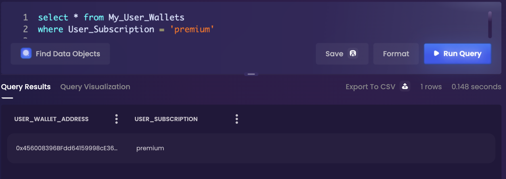

# 连接到 Space and Time

## 连接方式：dApp、REST API 或 JDBC

有几种方法可以连接到Space and Time，具体取决于您的用例和偏好：

通过 Space and Time dapp 运行查询

连接到 Space and Time dApp 是迄今为止最简单、最快的入门方法，只需要一个连接的钱包即可开始运行查询。

**如何连接：**

1. 跳转到 [Space and Time dApp](https://uat-dappsxt.azureedge.net/)
2.  点击左上角的菜单图标，找到登录选项：\
    • Login with Wallet - 查看区块链和您的私人数据\
    • Continue Anonymously - 仅查看区块链数据，对返回的数据有限制\ <mark style="color:red;"></mark>

    <figure><figcaption></figcaption></figure>
3.  开始挖掘数据吧！您可以使用 dApp 可视化服务运行 SQL、探索 ERD 图并将数据可视化！\
    \

    <figure><figcaption></figcaption></figure>

通过 REST API 进行连接

构建者可能需要 API 连接来为应用程序和 dApps 提供动力，或者将Space and Time集成到其他开发环境中。这种编程方法需要设置更多东西。

**如何连接：**

1. 如果需要，用 API 服务注册用户 ID（每个用户一次）
2. 验证 UserID 并请求安全token（和重新验证token）
   * 仅供参考，SxT 使用 [biscuits](broken-reference) 来处理私有表的去中心化授权&#x20;
3. 您现在应该有了一个生效的token，可以使用它调用各种 SQL API 并提交查询！\
   \
   除了 SQL API 之外，还有越来越多的专业 API，例如区块链数据 API 和资源发现 API，而且还在不断增加。

通过 JDBC 连接

对于本地安装的应用程序，例如 IDE、商业智能 (BI) 工具等，通过 JDBC 连接通常是标准做法，也是 Space and Time 支持的东西。由于臃肿的客户端可设置的东西太多，以下说明是定向的，并且可能因工具而异。

**如何连接：**

1. 确保您运行的是 Java v11 或更高版本
2. 下载 SxT JDBC 驱动程序，将 JAR 文件保存到您选择的文件夹并记下位置
3.  打开本地的 JDBC 程序选项，并建立一个新连接：\
    _（这些说明会有所不同，具体取决于所使用的程序）_\
    • 选择“Generic JDBC”驱动程序选项\
    • 选中 手动选择驱动程序/.JAR 文件 的选项

    • 跳转到上一步中的文件夹并选择 .JAR 文件\
    • 单击 OK 返回设置屏幕\
    • 保存您的配置设置
4. JDBC 需要以下信息：\
   • **user** - 这将是您在 Space and Time 中注册的 UserID\
   • **password** - 这将是您注册过程中的私钥\
   &#x20;   \- 用于生成签名，从不在客户端以外使用\
   &#x20;   \- 或者，您可以将密码留空并添加一个名为 **privateKey** 的属性\
   **• publicKey** - 这将是与上述私钥对应的公钥\
   **• (可选) biscuit\_\<name>** - 绑定到许可表的 [biscuits](broken-reference) 列表。\
   &#x20;   \- 区块链表是公开的，不需要 biscuit\
   &#x20;   \- 对于 alpha 期间的私人数据表，每张表需要一个 biscuit \
   &#x20;      (biscuit\_\<tablename>)
5. 就是这些！您应该能够像任何其他数据库一样连接到 SxT 并与之交互！

